# 🛋️ SofaCare Pro

A structured platform designed for the complete management of professional sofa cleaning services. It handles order creation, strict state transitions, secure proof uploads with sofa health scores, user role assignment, and shows calculated dashboard statistics for business review.

## Application Access
[**Live Application →**](https://sofacarepro1.vercel.app/)

* customer@sofacarepro<!-- -->.example
* cleaner@sofacarepro<!-- -->.example
* manager@sofacarepro<!-- -->.example
* owner@sofacarepro<!-- -->.example
* Password: Pass@123

## Table of Contents
* [Key Features](#key-features)
* [Tech Stack](#tech-stack)
* [Application Architecture](#application-architecture)
* [Folder Structure](#folder-structure)
* [Setup & Installation](#setup--installation)
* [API Endpoints](#api-endpoints)
* [Screenshots](#screenshots)
* [License](#license)
* [Author](#author)

## Key Features
* **4-Tier Role-Based Access Control (RBAC):** Secure JWT authentication with role-specific dashboards and controlled access for Customers, Field Cleaners, Managers, and Owners.
* **State Transitions:** Enforces controlled status changes from Pending to Completed or Reclean based on the actions taken at each step.
* **Status Visibility:** Shows time-based status updates along with changes, allowing users to clearly understand the current step and previous steps.
* **Completion Proof:** Includes before-and-after images as proof of completion, showing the visible improvements between them, with the changes reviewed before completing or assigning for reclean.
* **Health Scoring:** Calculates a health score for each sofa (e.g., SOFA-1, SOFA-2) using the defined scoring logic and input data.
* **Role Assignment:** Allows users with access to update the roles of others based on the roles allowed to them. Users cannot change their own role.
* **Dashboard Statistics:** Shows role-related or business statistics based on the user's role and access for a clear understanding of the current data.

## Tech Stack
* **Frontend:** React, Vite
* **Backend:** Node.js, Express.js
* **Language:** TypeScript
* **Database:** MongoDB, Mongoose
* **State & Routing:** Redux Toolkit, React Router
* **API & Security:** Axios, JWT, bcryptjs
* **UI & Components:** Bootstrap, React Bootstrap, Lucide React, Recharts
* **Image Handling:** Multer, ImageKit
* **Deployment:** Vercel, Render, MongoDB Atlas

## Application Architecture
The application utilizes a decoupled **Client-Server Architecture**, allowing scalability while maintaining a clear separation between the UI and business logic.

### Frontend
A **Component-Driven Architecture** structured around user roles and shared components:
* **Role-Based Routing:** Dashboards and pages are separated by user role for customers, field cleaners, managers, and owners, with a shared order page. Access is protected by route guards.
* **Component Modularity:** Application pages are built with reusable UI components, improving maintainability and design consistency.
* **Global State:** State management centralizes application data while reducing prop drilling and handling asynchronous requests.
* **API Integration:** A centralized API client manages requests, automatically including HTTP-only cookies and handling unauthorized (401) responses.
* **Services:** Handle requests using the API client while managing business logic and data formatting, maintaining a clear separation between application logic and UI rendering.

### Backend
A **Multi-Tiered Layered Architecture (Controller-Service-Repository)** that strictly isolates responsibilities:
* **Routes:** Define REST API endpoints and direct incoming requests to their corresponding controllers for proper request handling.
* **Middleware:** Manages JWT authentication, enforces Role-Based Access Control (RBAC), and handles undefined routes and application errors.
* **Controllers:** Receive HTTP requests, validate inputs, call the appropriate services, and send formatted responses to the frontend.
* **Services:** Execute core business logic, enforce strict order state transitions, calculate dashboard statistics, and handle external media processing.
* **Repositories:** Hide direct database queries. Services use repositories to access data, keeping business logic independent of the underlying database and its query syntax.
* **Database & Models:** Define and enforce strict data schemas to consistently store application data (Users, Orders, Stats) in the database.

### Request Handling Diagram
```text
[ React ] ─────────────────────┐
    │                          │
    v                          │
[ Redux Toolkit ]              │
    │                          │
    v                          │
[ Axios ] <────────────────────┘
    │
    v
REST API
    |
    v
[ Routes ]
    │
    v
[ Middleware ]
    │
    v
[ Controllers ]
    │
    v
[ Services ]
    │
    ├──────────────────> [ ImageKit ]
    │
    v
[ Repositories ]
    │
    v
[ Models ]
    │
    v
[ MongoDB ]
```

### Order Handling Diagram
```text
[ Customer: Create an Order ]
            │
            v
       [ Pending ]
            │
            v
[ Manager: Approve or Reject an Order ]
            │
       ┌────┴──────┐
    Reject      Approve
       │           │
       v           v
[ Rejected ]  [ Approved ]
                   │
                   v
[ Manager: Assign a Cleaner ]
                   │
                   v
              [ Assigned ]
                   │
                   v
[ Field Cleaner: Handle Cleaning ]
                   │
                   v
             [ In Progress ]
                   │
                   v
[ Field Cleaner: Submit Images and Health Scores ]
                   │
                   v
               [ Review ] <───────────────────────────────┐
                   │                                      │
                   v                                      │
[ Manager: Review an Order ]                              │
                   │                                      │
              ┌────┴─────────────────┐                    │
           Reclean                Complete                │
              │                      │                    │
              v                      v                    │
[ Manager: Assign a Cleaner ]  [ Completed ]              │
              │                                           │
              v                                           │
         [ Assigned ]                                     │
              │                                           │
              v                                           │
[ Field Cleaner: Handle Recleaning ]                      │
              │                                           │
              v                                           │
        [ In Progress ]                                   │
              │                                           │
              v                                           │
[ Field Cleaner: Submit Images and Health Scores ] ───────┘


[ Owner: Dashboard Statistics ]
```

## Folder Structure
```text
SofaCare-Pro/
│
├── backend/
│   ├── dist/
│   ├── node_modules/
│   ├── src/
│   │   ├── config/
│   │   │   ├── database.ts
│   │   │   ├── env.ts
│   │   │   └── multer.ts
│   │   ├── controllers/
│   │   │   ├── auth.controller.ts
│   │   │   ├── order.controller.ts
│   │   │   └── user.controller.ts
│   │   ├── dto/
│   │   │   ├── auth.dto.ts
│   │   │   ├── order.dto.ts
│   │   │   └── user.dto.ts
│   │   ├── middleware/
│   │   │   ├── auth.middleware.ts
│   │   │   ├── error.middleware.ts
│   │   │   └── notFound.middleware.ts
│   │   ├── models/
│   │   │   ├── dashboardStats.model.ts
│   │   │   ├── order.model.ts
│   │   │   └── user.model.ts
│   │   ├── repositories/
│   │   │   ├── dashboardStats.repository.ts
│   │   │   ├── order.repository.ts
│   │   │   └── user.repository.ts
│   │   ├── routes/
│   │   │   ├── auth.routes.ts
│   │   │   ├── order.routes.ts
│   │   │   └── user.routes.ts
│   │   ├── services/
│   │   │   ├── auth.service.ts
│   │   │   ├── dashboardStats.service.ts
│   │   │   ├── image.service.ts
│   │   │   ├── order.service.ts
│   │   │   └── user.service.ts
│   │   ├── types/
│   │   │   ├── mongoose.types.ts
│   │   │   ├── order.interface.ts
│   │   │   └── user.interface.ts
│   │   ├── utils/
│   │   │   ├── appError.ts
│   │   │   └── orderMapper.ts
│   │   ├── app.ts
│   │   └── index.ts
│   ├── .env
│   ├── .gitignore
│   ├── package-lock.json
│   ├── package.json
│   └── tsconfig.json
│
├── frontend/
│   ├── dist/
│   ├── node_modules/
│   ├── public/
│   ├── src/
│   │   ├── assets/
│   │   ├── components/
│   │   │   ├── Footer.tsx
│   │   │   ├── Layout.tsx
│   │   │   ├── Navigation.tsx
│   │   │   └── ProfileOffcanvas.tsx
│   │   ├── pages/
│   │   │   ├── cleaner/
│   │   │   │   ├── AssignedOrders.tsx
│   │   │   │   ├── CleanerDashboard.tsx
│   │   │   │   ├── CleanerDashboardCards.tsx
│   │   │   │   ├── CompletedOrders.tsx
│   │   │   │   └── InProgressOrders.tsx
│   │   │   ├── customer/
│   │   │   │   ├── CreateOrderModal.tsx
│   │   │   │   ├── CustomerDashboard.tsx
│   │   │   │   ├── CustomerDashboardCards.tsx
│   │   │   │   └── CustomerOrders.tsx
│   │   │   ├── manager/
│   │   │   │   ├── CleanerAssignment.tsx
│   │   │   │   ├── CompletedOrders.tsx
│   │   │   │   ├── InReviewOrders.tsx
│   │   │   │   ├── ManagerDashboard.tsx
│   │   │   │   ├── ManagerDashboardCards.tsx
│   │   │   │   ├── PendingOrders.tsx
│   │   │   │   └── RoleAssignment.tsx
│   │   │   ├── owner/
│   │   │   │   ├── OwnerDashboard.tsx
│   │   │   │   ├── OwnerDashboardCards.tsx
│   │   │   │   ├── OwnerDashboardStats.tsx
│   │   │   │   ├── OwnerOrders.tsx
│   │   │   │   └── RoleAssignment.tsx
│   │   │   ├── sofaCleaningOrder/
│   │   │   │   ├── OrderCard.tsx
│   │   │   │   ├── OrderImages.tsx
│   │   │   │   ├── OrderPage.tsx
│   │   │   │   └── OrderStatuses.tsx
│   │   │   └── user/
│   │   │       ├── UserLogin.tsx
│   │   │       └── UserRegister.tsx
│   │   ├── protectedRoutes/
│   │   │   ├── CleanerProtectedRoute.tsx
│   │   │   ├── CustomerProtectedRoute.tsx
│   │   │   ├── ManagerProtectedRoute.tsx
│   │   │   ├── OwnerProtectedRoute.tsx
│   │   │   └── UserProtectedRoute.tsx
│   │   ├── redux/
│   │   │   ├── hooks.ts
│   │   │   ├── store.ts
│   │   │   ├── userSlice.ts
│   │   │   └── userThunk.ts
│   │   ├── services/
│   │   │   └── axios.ts
│   │   ├── types/
│   │   │   ├── sofaCleaningOrder.types.ts
│   │   │   ├── stats.types.ts
│   │   │   └── user.types.ts
│   │   ├── App.tsx
│   │   └── main.tsx
│   ├── .env
│   ├── .gitignore
│   ├── eslint.config.js
│   ├── index.html
│   ├── package-lock.json
│   ├── package.json
│   ├── tsconfig.app.json
│   ├── tsconfig.json
│   ├── tsconfig.node.json
│   └── vite.config.ts
│
├── screenshots/
│
└── README.md
```

## Setup & Installation

### Prerequisites
1. Node.js and npm
2. Git
3. MongoDB connection
4. ImageKit connection

### Installation
1. Clone the repository and navigate into the application:
   ```bash
   git clone https://github.com/kivoxff/SofaCare-Pro.git
   cd SofaCare-Pro
   ```

2. Set up the Frontend
   ```bash
   cd frontend
   npm install
   ```
   *Update the existing `.env` file, or create a new one in the `frontend` directory with the following variables:*
   ```env
   VITE_API_BASE_URL=your_backend_base_url
   ```
   *Development Server:*
   ```bash
   npm run dev  
   # or 
   npx vite
   ```
   *Production Build (static files):*
   ```bash
   npm run build
   ```

3. Set up the Backend
   ```bash
   cd ../backend
   npm install
   ```
   *Update the existing `.env` file, or create a new one in the `backend` directory with the following variables:*
   ```env
   PORT=5000
   MONGO_URI=your_mongodb_connection_string
   JWT_SECRET=your_jwt_secret
   IMAGEKIT_PUBLIC_KEY=your_public_key
   IMAGEKIT_PRIVATE_KEY=your_private_key
   IMAGEKIT_URL_ENDPOINT=your_url_endpoint
   APP_URL=your_frontend_app_url
   ```
   *Development Server:*
   ```bash
   npx nodemon --watch src --ext ts --exec ts-node src/index.ts
   ```
   *Production Server (Compile TypeScript and Run):*
   ```bash
   npx tsc
   node dist/index.js
   ```
   *Production Server (Optional: PM2 Process Management):*
   ```bash
   npx tsc
   pm2 start dist/index.js --name "SofaCare-Pro"
   ```

## API Endpoints
**Standard Response Wrappers:**
* **Success:** `{ "success": true, "message": "...", "data": { ... } }`
* **Error:** `{ "success": false, "message": "..." }`

---

### 1. Authentication Routes (`/api/auth`)

#### Register User
* **Route:** `POST /register`
* **Auth Required:** None
* **Content-Type:** `multipart/form-data`
* **Payload:**
  ```json
  {
    "fullName": "string",
    "email": "string",
    "password": "string",
    "role": "string (optional, default: Customer)",
    "profileImage": "file (optional)"
  }
  ```
* **Response (201 Created):**
  ```json
  {
    "id": "string",
    "fullName": "string",
    "email": "string",
    "role": "Customer | Field_Cleaner | Manager | Owner",
    "profileImage": "string (URL) | null",
    "createdAt": "Date string"
  }
  ```

#### Login User
* **Route:** `POST /login`
* **Auth Required:** None
* **Content-Type:** `application/json`
* **Payload:**
  ```json
  {
    "email": "string",
    "password": "string"
  }
  ```
* **Response (200 OK):** Sets HTTP-only `token` cookie.
  ```json
  {
    "id": "string",
    "fullName": "string",
    "email": "string",
    "role": "Customer | Field_Cleaner | Manager | Owner",
    "profileImage": "string (URL) | null",
    "createdAt": "Date string"
  }
  ```

#### Logout User
* **Route:** `POST /logout`
* **Auth Required:** None
* **Content-Type:** None
* **Payload:** None
* **Response (200 OK):** Clears HTTP-only `token` cookie.

---

### 2. User Routes (`/api/users`)

#### Update User Role
* **Route:** `PATCH /:id/role`
* **Auth Required:** Owner (All Roles), Manager (Customer & Field_Cleaner Roles Only)
* **Content-Type:** `application/json`
* **Payload:**
  ```json
  {
    "role": "Customer | Field_Cleaner | Manager | Owner"
  }
  ```
* **Response (200 OK):**
  ```json
  {
    "id": "string",
    "email": "string",
    "fullName": "string",
    "role": "string",
    "createdAt": "Date string",
    "updatedAt": "Date string"
  }
  ```

#### Get Users By Role
* **Route:** `GET /role/:role`
* **Auth Required:** Owner (All Roles), Manager (Customer & Field_Cleaner Roles Only)
* **Content-Type:** None
* **Payload:** None (Uses URL Parameter: role)
* **Response (200 OK):**
  ```json
  [
    {
      "id": "string",
      "email": "string",
      "fullName": "string",
      "role": "string",
      "createdAt": "Date string",
      "updatedAt": "Date string"
    },
    {
      "...": "additional user objects"
    }   
  ]
  ```

---

### 3. Order Routes (`/api/orders`)

#### Create New Cleaning Order
* **Route:** `POST /`
* **Auth Required:** Any authenticated user
* **Content-Type:** `application/json`
* **Payload:**
  ```json
  {
    "cleaningType": "Deep Cleaning | Steam Cleaning | Shampoo Cleaning | Dry Cleaning | Leather Cleaning & Conditioning",
    "sofaCount": "number",
    "customerAddress": "string"
  }
  ```
* **Response (201 Created):**
  ```json
  {
    "id": "string",
    "cleaningType": "string",
    "orderStatus": "pending",
    "totalPrice": "number",
    "sofaCount": "number"
  }
  ```

#### Get Customer Orders
* **Route:** `GET /customer`
* **Auth Required:** Any Authenticated User (Own Orders Only)
* **Content-Type:** None
* **Payload:** None
* **Response (200 OK):**
```json
[
  {
    "id": "string",
    "customer": {
      "id": "string",
      "fullName": "string"
    },
    "customerAddress": "string",
    "cleaningType": "string",
    "orderStatus": "pending | approved | assigned | in-progress | review | reclean | completed",
    "fieldCleaner": {
      "id": "string | null",
      "fullName": "string | null"
    },
    "manager": {
      "id": "string | null",
      "fullName": "string | null"
    },
    "cleaningDate": "Date string | null",
    "totalPrice": "number",
    "statusEvents": [
      {
        "step": "pending",
        "label": "string",
        "icon": "string",
        "timestamp": "Date string"
      },
      {
        "...": "additional status event objects"
      }
    ],
    "sofas": [
      {
        "sofaId": "SOFA-1",
        "status": "pending | completed | reclean-required",
        "healthScore": "number",
        "images": {
          "before": "string (URL) | null",
          "after": "string (URL) | null"
        }
      },
      {
        "...": "additional sofa objects"
      }
    ]
  },
  {
    "...": "additional order objects"
  }
]
```

#### Get Internal Orders
* **Route:** `GET /internal`
* **Auth Required:** Manager / Owner (All Orders), Field Cleaner (Assigned Orders Only)
* **Content-Type:** None
* **Payload:** None
* **Response (200 OK):**
```json
[
  {
    "id": "string",
    "customer": {
      "id": "string",
      "fullName": "string"
    },
    "cleaningType": "string",
    "orderStatus": "pending | approved | assigned | in-progress | review | reclean | completed",
    "fieldCleaner": {
      "id": "string | null",
      "fullName": "string | null"
    },
    "manager": {
      "id": "string | null",
      "fullName": "string | null"
    },
    "cleaningDate": "Date string | null",
    "totalPrice": "number",
    "statusEvents": [
      {
        "step": "pending",
        "label": "string",
        "icon": "string",
        "timestamp": "Date string"
      },
      {
        "...": "additional status event objects"
      }
    ],
    "sofas": [
      {
        "sofaId": "SOFA-1",
        "status": "pending | completed | reclean-required",
        "healthScore": "number",
        "images": {
          "before": "string (URL) | null",
          "after": "string (URL) | null"
        }
      },
      {
        "...": "additional sofa objects"
      }
    ]
  },
  {
    "...": "additional order objects"
  }
]
```

#### Get Order By ID
* **Route:** `GET /:id`
* **Auth Required:** Manager / Owner (All Orders), Field Cleaner (Assigned Orders Only), Any Authenticated User (Own Orders Only)
* **Content-Type:** None
* **Payload:** None (Uses URL Parameter: id)
* **Response (200 OK):**
```json
{
  "id": "string",
  "customer": {
    "id": "string",
    "fullName": "string"
  },
  "cleaningType": "string",
  "orderStatus": "pending | approved | assigned | in-progress | review | reclean | completed",
  "fieldCleaner": {
    "id": "string | null",
    "fullName": "string | null"
  },
  "manager": {
    "id": "string | null",
    "fullName": "string | null"
  },
  "cleaningDate": "Date string | null",
  "totalPrice": "number",
  "statusEvents": [
    {
      "step": "pending",
      "label": "string",
      "icon": "string",
      "timestamp": "Date string"
    },
    {
      "...": "additional status event objects"
    }
  ],
  "sofas": [
    {
      "sofaId": "SOFA-1",
      "status": "pending | completed | reclean-required",
      "healthScore": "number",
      "images": {
        "before": "string (URL) | null",
        "after": "string (URL) | null"
      }
    },
    {
      "...": "additional sofa objects"
    }
  ]
}
```

#### Transition Order Status
* **Route:** `PATCH /:id/transition`
* **Auth Required:** Manager / Owner (All Orders), Field Cleaner (Assigned Orders Only)
* **Process Constraints:** Order status transitions must follow the defined lifecycle sequence.
* **Content-Type:** `application/json`
* **Payload:** Accepts ONE of the following transition objects:
  ```json
  { "transition": "approve" }
  ```
  ```json
  { "transition": "reject" }
  ```
  ```json
  {
    "transition": "assign",
    "fieldCleaner": { "id": "string", "fullName": "string" },
    "cleaningDate": "Date string"
  }
  ```
  ```json
  { "transition": "start" }
  ```
  ```json
  { "transition": "complete" }
  ```
  ```json
  {
    "transition": "reclean",
    "failedSofas": ["SOFA-1", "SOFA-2"]
  }
  ```
* **Response (200 OK):** Returns the updated order object with the latest order details and `statusEvents`.

#### Submit Job Completion
* **Route:** `PATCH /:id/completion`
* **Auth Required:** Manager / Owner (All Orders), Field Cleaner (Assigned Orders Only)
* **Process Constraints:** Job completion data can only be submitted at the appropriate lifecycle stage.
* **Content-Type:** `multipart/form-data`
* **Payload:**
  ```json
  {
    "healthScores": "{ 'SOFA-1': 85, 'SOFA-2': 95 } (stringified JSON)",
    "before_SOFA-1": "file (dynamic key)",
    "after_SOFA-1": "file (dynamic key)",
    "before_SOFA-2": "file (dynamic key)",
    "after_SOFA-2": "file (dynamic key)"
  }
  ```
* **Response (200 OK):** Returns the updated order object with the latest order details, attached image URLs, updated sofa health scores, and `statusEvents`.

#### Get Dashboard Stats
* **Route:** `GET /dashboardStats`
* **Auth Required:** Owner Only
* **Content-Type:** None
* **Payload:** None
* **Response (200 OK):**
  ```json
  {
    "orders": {
      "totalOrders": "number",
      "pendingOrders": "number",
      "inProgressOrders": "number",
      "reviewOrders": "number",
      "recleanOrders": "number",
      "completedOrders": "number"
    },
    "revenue": {
      "totalRevenue": "number"
    },
    "sofas": {
      "totalSofasCleaned": "number",
      "recleanSofasCount": "number"
    }
  }
  ```

---

### 4. Application Routes (`/api`)

#### Server Up Check
* **Route:** `GET /up`
* **Auth Required:** Owner Only
* **Content-Type:** None
* **Payload:** None
* **Response (200 OK):**
  ```json
  {
    "success": true,
    "message": "Server is running..."
  }
  ```

## Screenshots

### Customer Dashboard
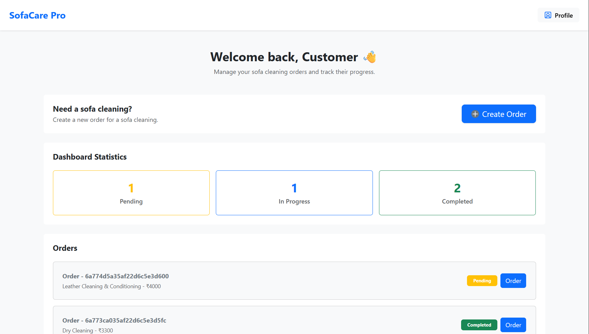
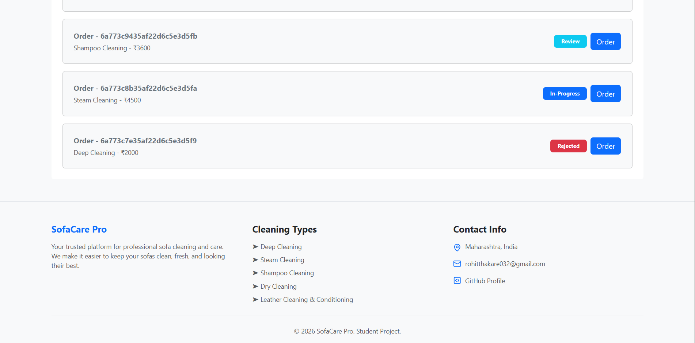

### Manager Dashboard
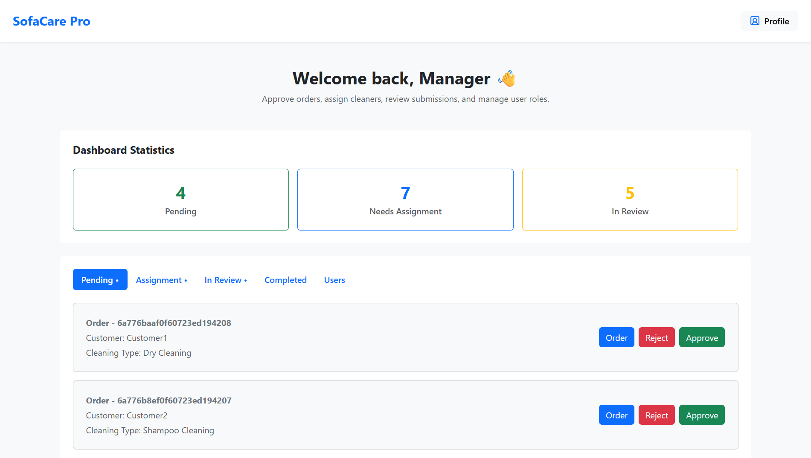
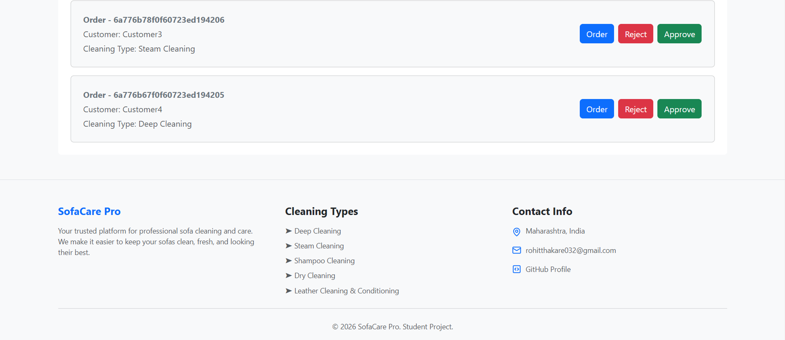

### Field Cleaner Dashboard
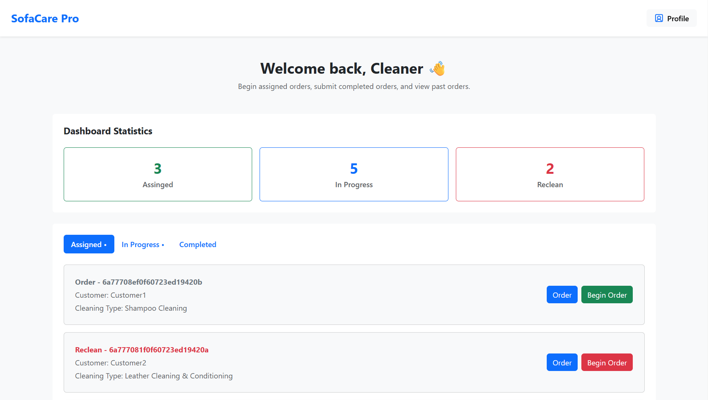
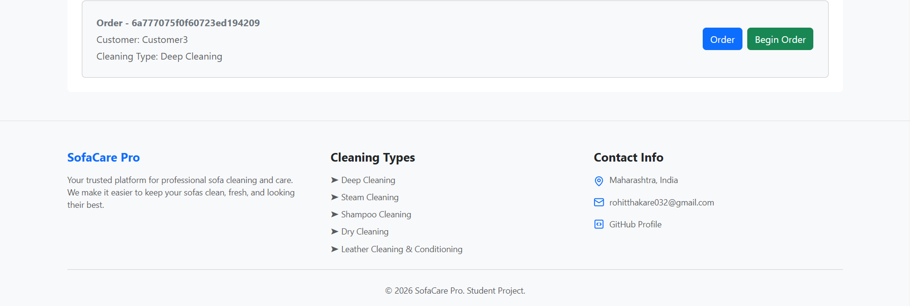

### Owner Dashboard
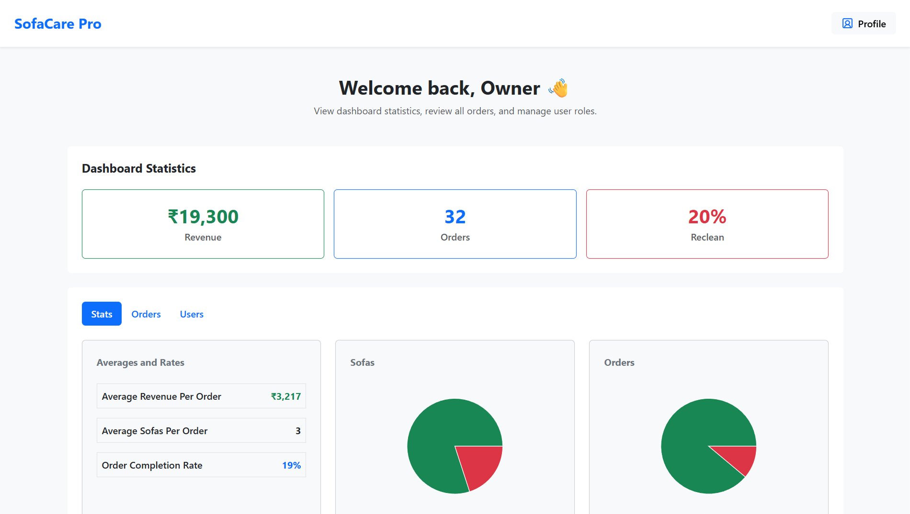
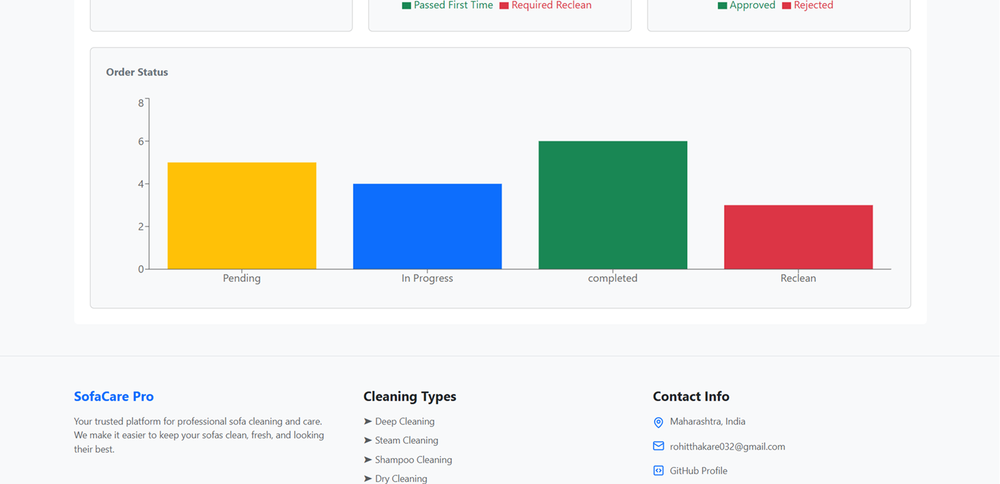
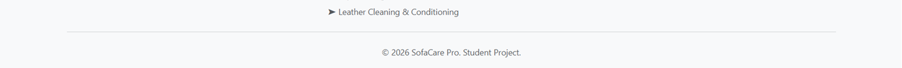

### Order Page
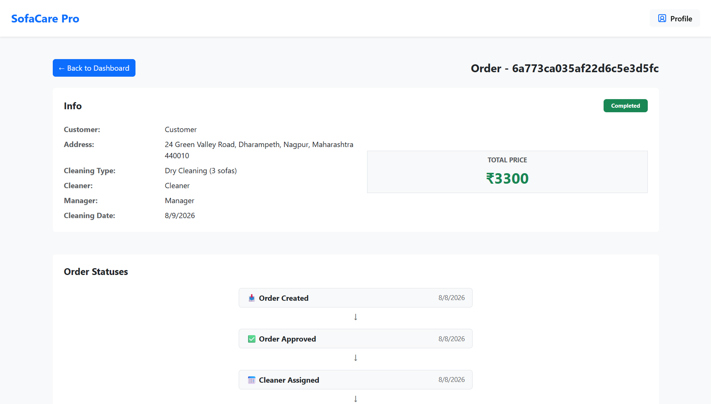
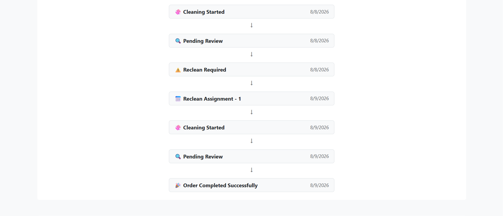
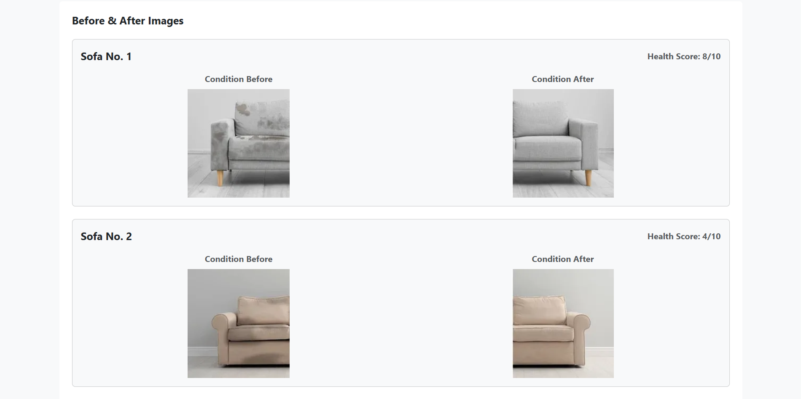
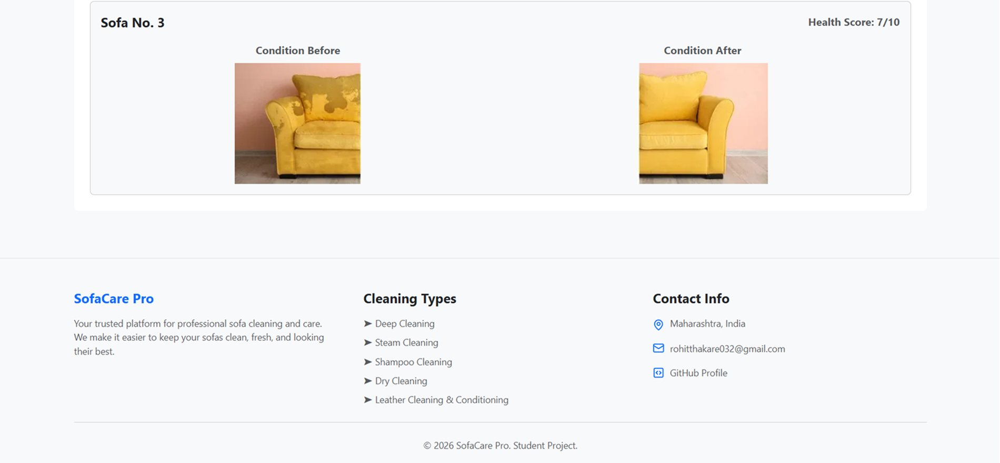

## License
All rights reserved.

## Author
**Rohit Thakare**